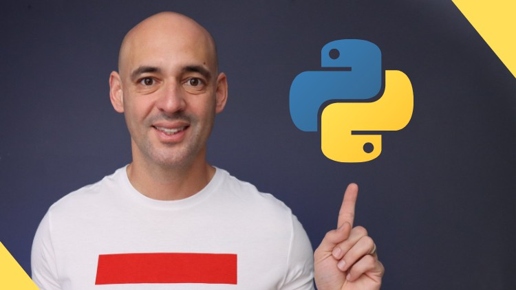

 

<h1 align="center"> Udemy - Curso de Programação PYTHON do ZERO ao Avançado 2023 </h1>

O curso de Programação PYTHON do ZERO ao Avançado 2023, ministrado pelo professor André Iacono, é um curso completo para quem deseja aprender Python do básico ao avançado e se tornar um desenvolvedor Python intermediário.

 

  

 

  <a href="#-tecnologias">🚀 Tecnologias</a>&nbsp;&nbsp;&nbsp;|&nbsp;&nbsp;&nbsp;
  <a href="#-desafios">💻 Desafios</a>&nbsp;&nbsp;&nbsp;|&nbsp;&nbsp;&nbsp;
  <a href="#-certificado">📜 Certificado</a>&nbsp;&nbsp;&nbsp;|&nbsp;&nbsp;&nbsp;
  <a href="#memo-licença">:memo: Licença</a>

 

## 🚀 Tecnologias

Neste curso foi utilizada a seguinte tecnologia:

 

## 💻 Desafios

- [Calculadora Pintura](https://github.com/ThiagoMonts/udemy_python/blob/main/Desafios/Se%C3%A7%C3%A3o%2012%20-%20Projetos/calculadoraPintura.py)
- [Cálculo IMC](https://github.com/ThiagoMonts/udemy_python/blob/main/Desafios/Se%C3%A7%C3%A3o%2012%20-%20Projetos/calculoIMC.py)
- [Filtrando Funcionários](https://github.com/ThiagoMonts/udemy_python/blob/main/Desafios/Se%C3%A7%C3%A3o%2012%20-%20Projetos/filtrandoFuncionarios.py)
- [Ponto da Carne](https://github.com/ThiagoMonts/udemy_python/blob/main/Desafios/Se%C3%A7%C3%A3o%2012%20-%20Projetos/pontoDaCarne.py)

 

## 📜 Certificado

Conclusão do Curso: 02/08/2023

  

 

## :memo: Licença

Esse projeto está sob a licença MIT.

---

Desenvolvido por [Thiago Honorato](https://www.linkedin.com/in/honoratothiago/)
